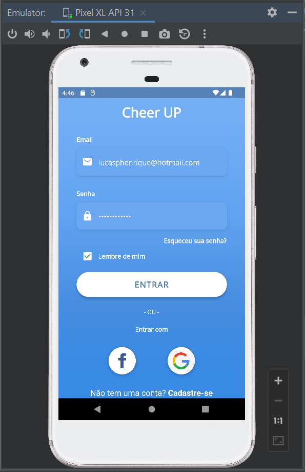
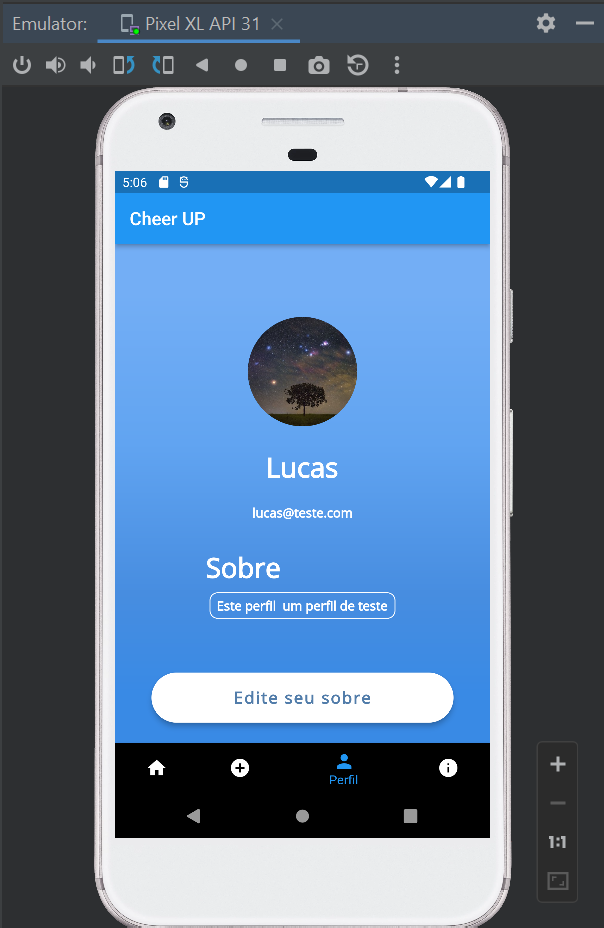

# CheerUp
Um aplicativo de divulgação de eventos, desenvolvido para a matéria de Laboratório de Desenvolvimento de Dispositivos Móveis durante o 1º Semestre de 2022. O aplicativo tem integração com Firebase, dando ao usuário opções de cadastro de Usuário, cadastro de Evento, Alteração de perfil (com acréscimo de imagem de perfil) e um sistema de votação para os Eventos. Em versões anteriores o aplicativo funcionava com banco de dados local, porém foi migrado para o Firebase para o estudo do uso da ferramenta e ganho de performarce.

  A seguir apresento imagens de algumas telas desenvolvidas e/ou funcionalidades do app.
  
* ### **Ícone personalizado**
 
 O ícone do aplicativo foi customizado com a logo do aplicativo.
  

    
  

* ### **Tela de cadastro de Usuário**
  
 A tela de cadastro do usuário, possui verificações sobre a senha e se já tem o email do usuário cadastrado em nossa base de dados.
  

    
  
 
 
* ### **Tela de Login**

Uma demonstração da tela de login, que contém funcionalidades de se cadastrar diretamente pelo app ou por outras redes sociais (funcionalidade em desenvolvimento).
  

    
  

  
  
* ### **Tela de Cadastro do Evento**

  

    
  
  
  
  
* ### **Base de dados Firebase**

Uma demonstração do banco de dados preenchido.
  

    
  
  

* ### **Tela principal do aplicativo**

Uma demonstração da tela principal do aplicativo, esta tela é responsável por mostrar os eventos já cadastrados e possui um sistema de ranking dos eventos mais votados (voto este interativo pelos próprios usuários).
  

    
  

  
* ### **Tela de Perfil do Usuário**

Uma demonstração da tela de Perfil do Usuário, esta tela é responsável por mostar as informações do usuário logado e permitir que seja adicionado uma imagem de perfil e uma descrição ao seu usuário.
  

    
  

